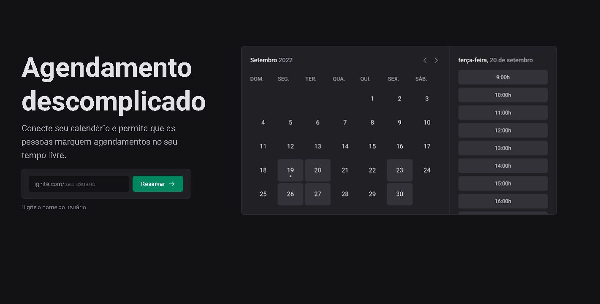

## Amaral | Call

  

### 🛠️ Nesse projeto foi utilizado

* NextJs
* Typescript
* Rocketseat Ignite-UI Design System
* Google APIs
* Phosphor-Icons
* Axios
* DayJs
* Zod
* Prisma
* Nookies
* React-hook-form
* Next-Seo
* Deploy do Banco de dados: PlanetScale

## 🚧 Layout

## :memo: Licença

Esse projeto está sob a licença MIT. Veja o arquivo [LICENSE](.github/LICENSE) para mais detalhes.

---

Feito com ♥ by JulioAmaral007

&nbsp;